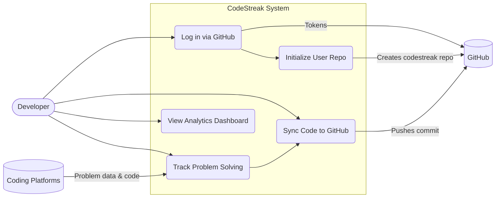

# CodeStreak Architecture

## Overview
CodeStreak is an application designed to help developers track their coding streaks across various platforms (LeetCode, GeeksforGeeks, CodingNinjas, CodeChef) by automatically syncing their progress to a GitHub repository.

## Components
- **Extension**: A Chrome Extension that acts as the user interface, handles GitHub OAuth authentication, and tracks user problem-solving progress.
- **Backend (Server)**: A Node.js/Express backend that handles GitHub OAuth token exchange, repository initialization, and potential syncing logic.
- **Frontend**: A web application UI for viewing statistics and managing settings.

## Use Case Diagram

## Data Flow
1. User logs in via the Chrome Extension using GitHub OAuth.
2. The Extension sends the temporary OAuth code to the Backend.
3. The Backend exchanges the code for a GitHub access token.
4. The Backend initializes the `codestreak` repository for the user with directories for different platforms.
5. Code solutions are formatted and pushed to GitHub via user interactions.

For component-specific architectures, please refer to:
- [Backend Architecture](./Backend-Architecture.md)
- [Extension Architecture](./Extension-Architecture.md)
- [Frontend Architecture](./FrontEnd-Architecture.md)
